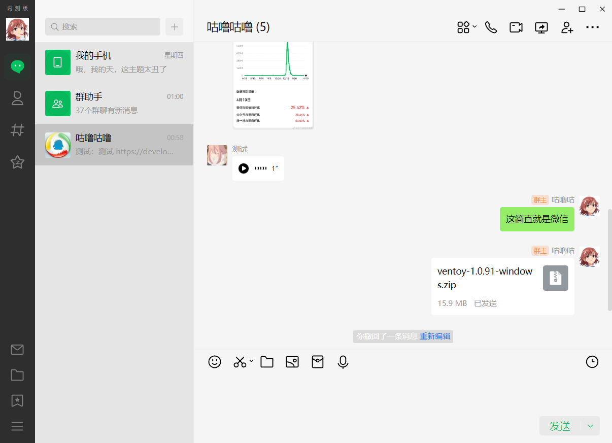

# LiteLoaderQQNT-Wechat-Theme

[LiteLoaderQQNT](https://github.com/LiteLoaderQQNT/LiteLoaderQQNT) 插件，高仿微信风格的 QQNT 主题，~~可以用于 QQ 聊天摸鱼时伪装微信办公~~

## 介绍

-   本主题仅为个人使用的**娱乐性质整蛊主题**
-   **不要与其他主题同时启用，会造成样式混乱**
-   仅支持 `QQ设置 - 白天模式` 下使用本主题
-   因为模仿了微信，所以本主题很难看 :D
-   在微信和 QQ 同时使用时极易出现信息发错软件的情况，请注意甄别哪个是 QQ 哪个是微信

## 版本适配

-   **仅适配 LiteLoaderQQNT 1.0.0 及以上版本**

## 使用方法

1. 安装插件 [PRO-2684/transitio](https://github.com/PRO-2684/transitio)

2. 下载本项目的 [wechat-theme.css](https://github.com/festoney8/LiteLoaderQQNT-Wechat-Theme/blob/v4/wechat-theme.css) 文件

3. 打开 transitio 插件的设置页面，在 CSS 片段列表中，导入 `wechat-theme.css` 文件

4. 开启 `wechat-theme` 项的开关，即可

## 截图

